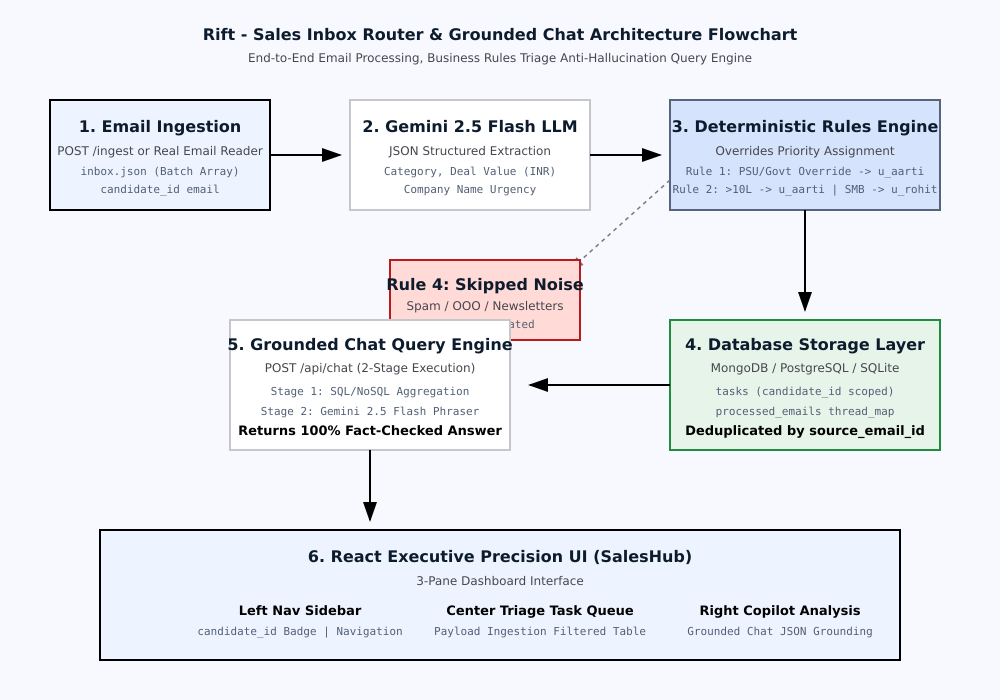

# RIFT — Sales Inbox Router & Grounded Chat

A production-grade enterprise sales inbox routing service and grounded conversational query interface.

RIFT automatically ingests raw B2B email payloads, extracts structured deal entities using a language model extraction pipeline, applies a deterministic business routing rules engine, persists deduplicated task records to MongoDB or SQLite/PostgreSQL, and answers natural-language queries using strict database-grounded execution with no hallucination.

---

## System Architecture



---

## Core Capabilities

### 1. Task API (`/tasks`, `/users`)
- Full Task CRUD: `POST`, `GET`, `PATCH`, `DELETE`
- Strict enum validation on `category`, `priority`, and `assignee_id`
- Candidate-scoped filtering by `assignee_id`, `category`, `priority`, `thread_id`, and date ranges
- Idempotent write guarantees — replaying duplicate ingestion batches never creates duplicate task records

### 2. Batch Ingest API (`/ingest`, `/api/ingest-single`)
- Async batch email routing pipeline with configurable concurrency
- Extracts deal value (INR), company name, due date, category, and priority via the language model extraction layer
- Thread reconciliation: replies to an existing thread update the matching task instead of creating a new one
- Rule 4 noise filtering: automatically skips out-of-office auto-replies, newsletters, and promotional spam

### 3. Business Rules Engine
| Rule | Description |
|---|---|
| **Rule 1 — PSU / Government Override** | Emails from government bodies or PSU-adjacent senders are assigned to Aarti (Enterprise), regardless of deal size |
| **Rule 2 — Deal Size Routing** | Deals ≥ ₹10,00,000 → Aarti (Enterprise); < ₹10,00,000 → Rohit (SMB) |
| **Rule 3 — Category Specialisation** | Marketing → Meera · Alliances/Partners → Karan · Billing/Finance → Divya · Ambiguous → Triage |
| **Rule 4 — Noise Filter** | Auto-replies, newsletters, and unsolicited vendor spam do not generate tasks |
| **Rule 5 — Currency Normalisation** | Parses Lakhs, Crores, USD→INR, formatted numbers, and range expressions to a single integer value |

### 4. Grounded Chat API (`/api/chat`)
- Two-stage, zero-hallucination query execution
- **Stage 1 — Query Planner**: maps the natural-language query to a structured database query plan (intent + filters)
- **Stage 2 — Phraser**: constructs the response using only computed database values — no free-form generation from memory
- Offline fallback: deterministic regex intent parser operates without external API access

### 5. Intelligence & Operations Layer
- Full ingestion run history with per-batch telemetry (tasks created, skipped, spurious rate)
- Decision trace: per-email audit log showing signals, rules triggered, assignee rationale, and confidence score
- Human triage workspace: intercept low-confidence or ambiguous emails, override routing, write audit notes
- Thread timeline: ordered history of all emails in a thread with field change deltas (priority, deal value)

### 6. Multi-Database Architecture
- **MongoDB** (Motor async driver) — primary in production
- **SQLite / PostgreSQL** (SQLAlchemy) — local development and serverless fallback
- Schema contracts are strictly matched between both backends; API output is identical regardless of storage layer

### 7. Vercel Deployment
- Pre-configured `vercel.json` for one-command deployment of both the React Vite frontend and FastAPI serverless backend

---

## Directory Structure

```
/
├── backend/
│   ├── app/
│   │   ├── main.py                    # FastAPI application entrypoint, CORS, clear-database guard
│   │   ├── config.py                  # Environment variable loading and email normalisation
│   │   ├── db/
│   │   │   ├── database.py            # SQLAlchemy engine and session factory
│   │   │   ├── models.py              # TaskModel, ProcessedEmailModel, ThreadMapModel, IngestionRunModel
│   │   │   └── mongo.py               # Motor async MongoDB client, index initialisation
│   │   ├── routers/
│   │   │   ├── tasks.py               # Task CRUD endpoints
│   │   │   ├── ingest.py              # Batch and single-email ingestion pipeline
│   │   │   ├── chat.py                # Grounded chat query endpoint
│   │   │   ├── stats.py               # Dashboard statistics and processed email log
│   │   │   ├── users.py               # Team roster and assignee lookup
│   │   │   └── intelligence.py        # Run history, decision trace, triage, thread timeline
│   │   └── services/
│   │       ├── gemini_service.py      # Language model extraction layer (async, connection-pooled)
│   │       ├── rules.py               # Deterministic routing rules engine and currency parser
│   │       ├── chat_executor.py       # Two-stage grounded chat executor
│   │       └── sample_generator.py    # Synthetic batch email generator for testing
│   ├── requirements.txt
│   ├── verify_all_endpoints.py        # Core endpoint integration test script
│   └── verify_intelligence_endpoints.py  # Intelligence layer integration test script
├── frontend/
│   ├── public/
│   │   └── rift_logo.png
│   ├── src/
│   │   ├── App.jsx                    # Root layout and view router
│   │   ├── components/
│   │   │   ├── Sidebar.jsx            # Navigation sidebar and candidate switcher
│   │   │   ├── JsonInput.jsx          # Batch email JSON paste and upload interface
│   │   │   ├── TaskDashboard.jsx      # Task table with inspection modal and thread timeline
│   │   │   ├── SingleEmailReader.jsx  # Single email compose and process interface
│   │   │   ├── SkippedLog.jsx         # Noise filter audit log
│   │   │   ├── ChatPanel.jsx          # Grounded chat query interface
│   │   │   ├── DecisionCenter.jsx     # Decision audit log, confidence telemetry, spurious rate
│   │   │   ├── ReviewQueue.jsx        # Human triage workspace and routing override form
│   │   │   └── RunHistory.jsx         # Ingestion run list and per-item trace inspector
│   │   └── index.css
│   ├── index.html
│   └── package.json
├── architecture_flowchart.png
├── vercel.json
├── DECISIONS.md                       # Engineering trade-offs and architecture rationale
├── EVALS.md                           # Routing precision, recall, and F1 evaluation report
└── README.md
```

---

## Getting Started

### Environment Variables

Create a `.env` file in the project root:

```env
# Language model API key
GEMINI_API_KEY=your_key_here
GEMINI_MODEL=gemini-2.5-flash

# MongoDB connection string (leave blank to use SQLite)
MONGODB_URL=

# SQL database URL (defaults to local SQLite)
DATABASE_URL=sqlite:///./sales_inbox.db

# Server port
PORT=8000
```

---

### Running Locally

**Backend (FastAPI)**

```bash
cd backend
pip install -r requirements.txt
python -m uvicorn app.main:app --host 0.0.0.0 --port 8000
```

Interactive API docs: `http://localhost:8000/docs`  
Health check: `http://localhost:8000/api/health`

**Frontend (React + Vite)**

```bash
cd frontend
npm install
npm run dev
```

Dashboard: `http://localhost:5173`

---

### Deploying to Vercel

```bash
npm i -g vercel
vercel
```

Both the React frontend (static) and FastAPI backend (serverless functions) are configured in `vercel.json`.

---

## API Reference

### Core Endpoints

| Method | Endpoint | Description |
|:---|:---|:---|
| `GET` | `/api/health` | Health check and database status |
| `POST` | `/api/ingest` | Batch email ingestion and routing |
| `POST` | `/api/ingest-single` | Process a single composed email |
| `GET` | `/api/tasks` | Query tasks (filtered by `candidate_id`, `category`, `priority`, etc.) |
| `POST` | `/api/tasks` | Manually create a task |
| `PATCH` | `/api/tasks/{id}` | Update task fields |
| `DELETE` | `/api/tasks/{id}` | Delete a task |
| `POST` | `/api/chat` | Grounded natural-language query |
| `GET` | `/api/stats` | Dashboard statistics and category distribution |
| `GET` | `/api/users` | Team roster and assignee list |
| `GET` | `/docs` | Interactive Swagger documentation |

### Intelligence & Operations Endpoints

| Method | Endpoint | Description |
|:---|:---|:---|
| `GET` | `/api/runs` | List ingestion run history for a candidate |
| `GET` | `/api/runs/{run_id}` | Run details with per-item trace |
| `GET` | `/api/decision-center` | Aggregate confidence telemetry and spurious rate |
| `GET` | `/api/triage` | Emails flagged for human review |
| `POST` | `/api/triage/{email_id}/review` | Commit a human review decision |
| `GET` | `/api/thread-timeline/{thread_id}` | Ordered thread history with field change deltas |

---

## Verification Scripts

Test all core endpoints against any environment:

```bash
cd backend
python verify_all_endpoints.py http://localhost:8000
# or against production:
python verify_all_endpoints.py https://rift-tan.vercel.app
```

Test the intelligence and operations layer:

```bash
cd backend
python verify_intelligence_endpoints.py http://localhost:8000
```

Both scripts print per-endpoint pass/fail status and exit with a non-zero code on any failure.

---

## Production Safety

- `POST /api/clear-database` is **blocked by default** in all environments
- Enabling it requires the `ALLOW_CLEAR_DATABASE=true` environment variable to be explicitly set
- Even when enabled, a `candidate_id` query parameter is required — only that candidate's data is deleted
- The primary production candidate is hardcoded as protected and cannot be cleared by this endpoint under any condition
